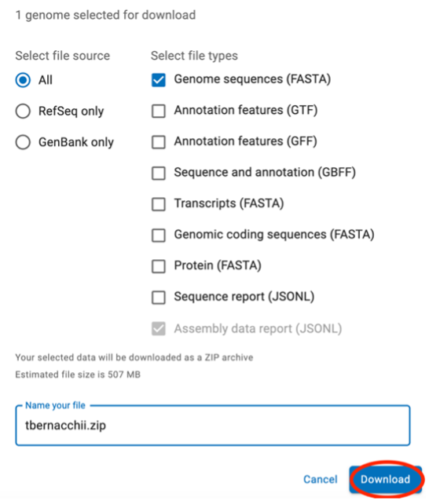

# TOA_clim_gen
This repository contains data files and scripts used for the genotype-environment association (GEA) and gene ontology (GO) analyses from the paper Caccavo et al. 2026b "Salinity exposure in early-life drives genomic adaptation to climate change in Antarctic toothfish (Dissostichus mawsoni)".

## pca
Scripts and input files required for the principal component analysis (PCA) of all eight environmental variables
- **pca_env_data_POC-C_8-10.R**: R script to run PCA on environmental variables from the Point of Capture–Time of Capture
(POC-C) scenario
- **pca_env_data_POC-C_8-10.csv**: input file with environmental data from the POC-C scenario
- **pca_env_data_SG-B_8-10.R**: R script to run PCA on environmental variables from the Spawning Ground–Time of Birth (SG-B) scenario
- **pca_env_data_SG-B_8-10.csv**: input file with environmental data from the SG-B scenario
- **pca_env_data_POC-B_8-10.R**: R script to run PCA on environmental variables from the Point of Capture–Time of Birth (POC-B) scenario
- **pca_env_data_POC-B_8-10.csv**: input file with environmental data from the POC-B scenario

## rda
Scripts and input files required for the redundancy analysis (RDA) based on fishing data and the scores derived from the PCA
- **rda27_5x_n24_POC_C_m8_9_10_PC3_fishing.R**: R script to run RDA on fishing data and PC scores derived from the POC-C scenario
- **rda27_5x_n24_POC_C_m8_9_10_PC3_fishing.csv**: input file with PC scores derived from the PCA of environmental variables from the POC-C scenario
- **rda24_5x_n24_SG_B_m8_9_10_PC3_fishing.R**: R script to run RDA on fishing data and PC scores derived from the SG-B scenario
- **rda24_5x_n24_SG_B_m8_9_10_PC3_fishing.csv**: input file with PC scores derived from the PCA of environmental variables from the SG-B scenario
- **rda26_5x_n24_POC_B_m8_9_10_PC3_fishing.R**: R script to run RDA on fishing data and PC scores derived from the POC-B scenario
- **rda26_5x_n24_POC_B_m8_9_10_PC3_fishing.csv**: input file with PC scores derived from the PCA of environmental variables from the POC-B scenario

### SNPs
Putatively-adaptive SNPs derived from RDA based on each environmental scenario (POC-C, SG-B, POC-B)

## lfmm
Scripts and input files required for the latent-factor mixed modelling (LFMM) analysis based on raw environmental data and scores derived from the PCA, all derived from the SG-B scenario
- **snmf_5x_n24.R**: R script to run snmf function as implemented in the R package LEA to choose K value for LFMM
- **5x_n24_SG_B_m8_9_10_k1.R**: R script to run LFMM separately for each envrionmental variable, PC score, and random variable
- **lfmm_5x_n24_SG_B_m8_9_10_sea_ice_thick.csv**: input file with sea ice thickness data
- **lfmm_5x_n24_SG_B_m8_9_10_sea_ice_conc.csv**: input file with sea ice concentration data
- **lfmm_5x_n24_SG_B_m8_9_10_mxl0.01.csv**: input file with with mixed-layer depth data at 0.01
- **lfmm_5x_n24_SG_B_m8_9_10_mxl0.03.csv**: input file with with mixed-layer depth data at 0.03
- **lfmm_5x_n24_SG_B_m8_9_10_sal.csv**: input file with with salinity data
- **lfmm_5x_n24_SG_B_m8_9_10_sst.csv**: input file with sea surface temperature data
- **lfmm_5x_n24_SG_B_m8_9_10_current_m.csv**: input file with meridional current velocity data
- **lfmm_5x_n24_SG_B_m8_9_10_current_z.csv**: input file with zonal current velocity data
- **lfmm_5x_n24_SG_B_m8_9_10_PC1.csv**: input file with scores derived from the first PC of the environmental variable PCA
- **lfmm_5x_n24_SG_B_m8_9_10_PC2.csv**: input file with scores derived from the second PC of the environmental variable PCA
- **lfmm_5x_n24_SG_B_m8_9_10_PC3.csv**: input file with scores derived from the third PC of the environmental variable PCA

### SNPs
Putatively-adaptive SNPs derived from LFMM based on each environmental variable, set of PC scores, and random variable

## false_positives
Scripts and input files required to run false-positive analysis
- **generate_random_env_data.R**: R script to generate 100 sets of random variables
- **pRDA_rand_5x_n24_1-100.R**: R script to run RDA on random sets of variables
- **pRDA_rand_5x_n24_1-100.csv**: input file with random sets of environmental variables

### SNPs
Putatively-adaptive SNPs derived from RDA based on random sets of variables

## gene_ontology

### STEP 1 – Map candidate regions to TOA genome
1. Install [bedtools](https://bedtools.readthedocs.io/en/latest/index.html) using [conda](https://anaconda.org/bioconda/bedtools)
```bash
conda install bioconda::bedtools`
bedtools v2.31.1`
```
2.	Create coordinates file using Excel to add and subtract 300 from the SNP locations
3.	Obtain 600bp sequence with outlier SNP (300bp flanking region) using TOA genome; run in prompt – finishes in <1 second
```bash
bedtools getfasta -fi .../D.mawsoni.genome.fasta -bed .../toa_toa_SG_B_854_putative_adaptive_SNPs_1_scans_coords.txt -fo .../toa_toa_SG_B_854_putative_adaptive_SNPs_1_scans.fasta
```

### STEP 2 – Blast candidate sequences against the same well-annotated
4. Download reference genome for Patagonian toothfish _Dissostichus mawsoni_ (TOP) [reference genome](https://www.ncbi.nlm.nih.gov/datasets/taxonomy/100907/) published in 2023; instructions for genome download are the same regardless of species


NOTE that if you have a VPN, it should be turned off for the download, otherwise it may not proceed correctly; you also may need to restart your browser after turning off VPN

5. Transfer the reference genome to the server

6. Make a genome database file using the RefSeq genome version (GCF_*); run in prompt – finishes in <1 second
`makeblastdb -in .../GCA_031216635.1_KU_De_1.0_genomic.fna -dbtype nucl -out .../deleginoides_refseq.db`

7. Blast 600 bp sequences retrieved from TOA genome against TOP genome database; run in prompt – finishes in <30 seconds
`blastn -query .../toa_toa_SG_B_854_putative_adaptive_SNPs_1_scans.fasta -db .../00b_deleginoides_genome/deleginoides_refseq.db -out .../toa_top_SG_B_854_putative_adaptive_SNPs_1_scans_coords.bed -outfmt 6`

### STEP 3 – Filter coords.bed output file from blast
8. Download the output .bed file to local computer and analyze scope of e-values, (change extension to .txt to open in Excel) `toa_top_SG_B_854_putative_adaptive_SNPs_1_scans_coords.xlsx`
    - Column headers can be found by searching for [blast bed output format](https://www.metagenomics.wiki/tools/blast/blastn-output-format-6)
    - Filter sequences where e >1.00E-50 (evalue), or outside of the 550 – 650 bp size range (length)
    - For the TOP genome, there were 27 genes with the JASDAP* Accession code, and thus lacking a chromosome number; as with the gene loc file preparation, these were removed from the SNP loc file
    - The goal is to have only 1 gene identified per SNP
    - Export SNP loc file as a .txt file with 3 columns: SNP ID (qseqid), chromosome (Chr number 1 start), and SNP position (appx SNP pos)`toa_top_SG_B_854_putative_adaptive_SNPs_1_scans_coords.txt`

### STEP 4 – Find genes within a X kb distance of candidate SNPs
9. Install [magma](https://journals.plos.org/ploscompbiol/article?id=10.1371%2Fjournal.pcbi.1004219)
    - Download [magma](https://vu.data.surfsara.nl/index.php/s/zkKbNeNOZAhFXZB) from [CNCR host site](https://cncr.nl/research/magma/)
    - Upload magma executable to server

10. Download [genome annotation of TOP](https://www.ncbi.nlm.nih.gov/datasets/gene/GCA_031216635.1/)


